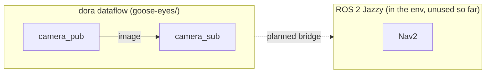

# Goose-Eyes

Autonomy code base for the 26-27 season. The runtime is a [dora-rs](https://dora-rs.ai) dataflow: each
node is its own process (Python today; Rust and C/C++ later), wired together by a YAML graph. The main
platform is the Jetson Orin; see [Setup](setup/index.md) for getting an environment on either it or a laptop.

This site is the hub: it documents how the system is structured and what each component's contract is
(inputs, outputs, message types, rates). Generated API reference sits underneath in
[API Reference](api/index.md).

## System map

Everything that runs today is one dora dataflow, the camera pub/sub demo. ROS 2 Jazzy is installed in
the environment (via RoboStack) for the navigation work to come, but nothing in this repo uses it yet.

## Where to look

| | |
|---|---|
| [Setup](setup/index.md) | install, how pixi works, the `jetson` platform, adding a dev platform |
| [dora](dora/index.md) | running the demo, [architecture](dora/architecture.md) (generated graph), per-node contracts |
| [API Reference](api/index.md) | Python module docs from docstrings; Rust / C++ slots reserved |
| [Updating the docs](contributing-docs.md) | the three `pixi run docs*` tasks and the docs-update workflow |
